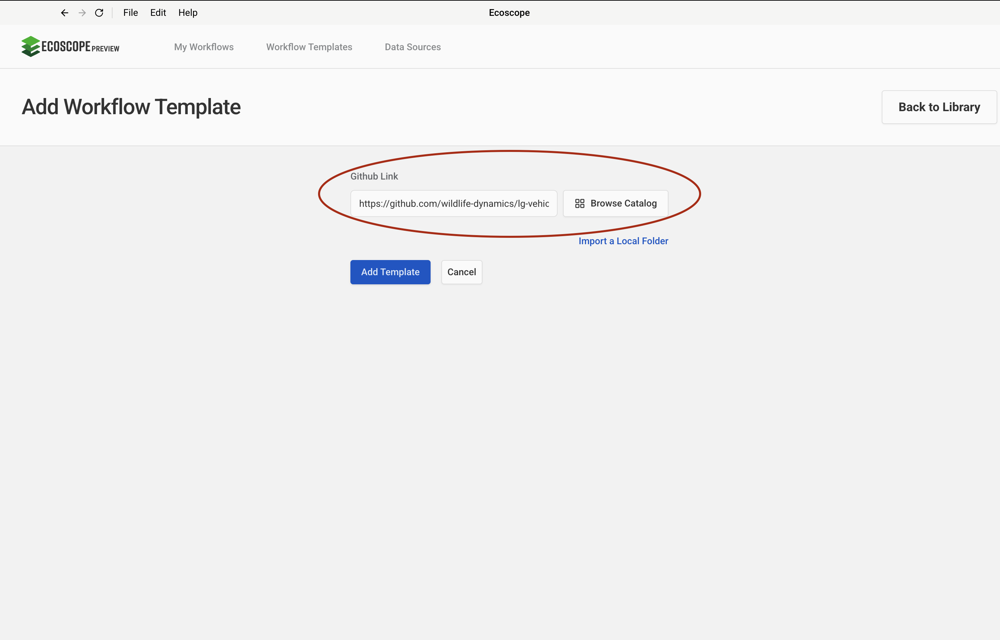
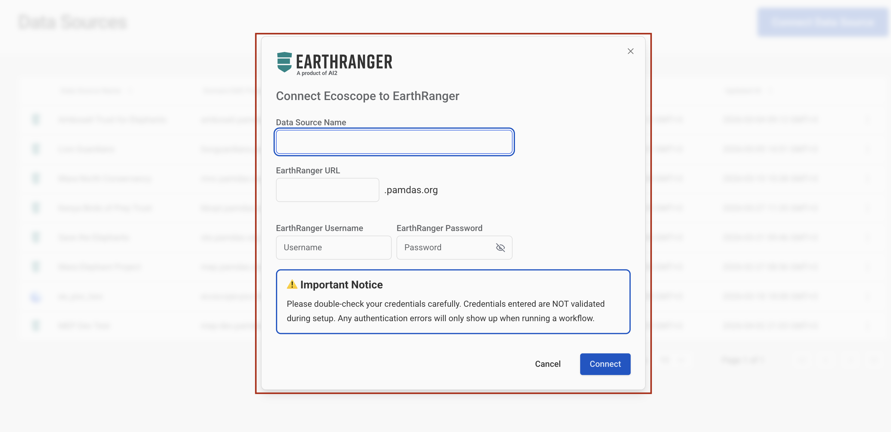
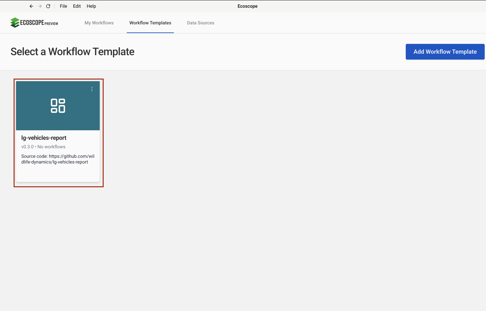
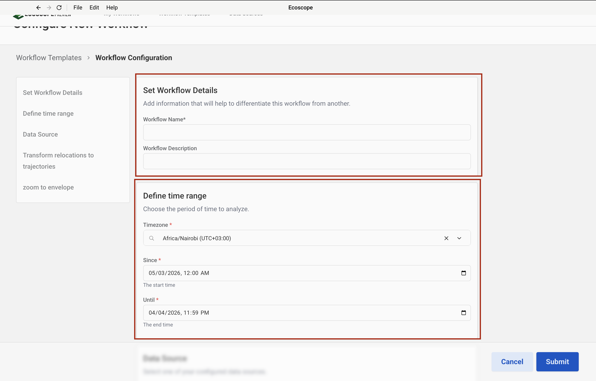
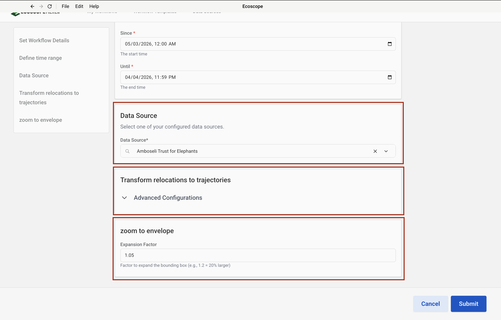

# LG Vehicles Report Workflow — User Guide

This guide walks you through configuring and running the LG Vehicles Report Workflow, which generates a vehicle movement analysis report for Lion Guardians in the Amboseli ecosystem sourced from EarthRanger.

---

## Overview

The workflow produces, for each tracked vehicle:

- A **Speed Map** — trajectory segments coloured by a 6-class speed palette (green → red)
- A **Vehicle Tracks Map** — uniform blue path overlay on boundary layers
- A **Speed Over Time line chart** — speed (km/h) plotted against date per vehicle
- **Scalar metric widgets** — Mean Speed, Min Speed, Max Speed, Distance covered
- A **per-vehicle summary CSV** — speed and distance statistics with a totals row
- A **Word document report** (`.docx`) — cover page plus one section per vehicle
- An **interactive widget dashboard**

---

## Prerequisites

Before running the workflow, ensure you have:

- Access to an **EarthRanger** instance with a configured data source
- The **Vehicles** subject group present in your EarthRanger instance

> The three spatial boundary files (group ranch boundaries, conflict hotspot areas, and protected areas) and both Word report templates are downloaded automatically from Dropbox — no local copies are required.

---

## Step-by-Step Configuration

### Step 1 — Add the Workflow Template

In the workflow runner, go to **Workflow Templates** and click **Add Workflow Template**. Paste the GitHub repository URL into the **Github Link** field:

```
https://github.com/wildlife-dynamics/lg-vehicles-report.git
```

Then click **Add Template**.



---

### Step 2 — Add an EarthRanger Connection

Navigate to **Data Sources** and add a new EarthRanger connection. Fill in:

- **Data Source Name** — a label to identify this connection
- **EarthRanger URL** — your instance URL (e.g. `your-site.pamdas.org`)
- **EarthRanger Username** and **EarthRanger Password**

> Credentials are not validated at setup time. Any authentication errors will appear when the workflow runs.



---

### Step 3 — Select the Workflow

After the template is added, it appears in the **Workflow Templates** list as **lg-vehicles-report**. Click it to open the workflow configuration form.

> The card may show **Initializing…** briefly while the environment is set up.



---

### Step 4 — Set Workflow Details and Define Time Range

The configuration form opens with two sections at the top.

**Set Workflow Details**

| Field | Description |
|-------|-------------|
| Workflow Name | A short name to identify this run |
| Workflow Description | Optional notes about the run (e.g. date range or vehicle group) |

**Define time range**

| Field | Description |
|-------|-------------|
| Timezone | Select the local timezone (e.g. `Africa/Nairobi UTC+03:00`) |
| Since | Start date and time of the analysis period |
| Until | End date and time of the analysis period |

All vehicle tracks and metrics are computed within this window.



---

### Step 5 — Data Source, Transform Relocations to Trajectories, and Zoom to Envelope

Scroll down to configure the remaining three sections.

**Data Source**

Select the EarthRanger connection configured in Step 2 from the **Data Source** dropdown. The workflow will fetch all observations for the **Vehicles** subject group from this instance.

**Transform relocations to trajectories** *(Advanced Configurations)*

These parameters control how raw GPS fixes are converted into trajectory segments. Expand **Advanced Configurations** to adjust the trajectory segment filters:

| Field | Default | Description |
|-------|---------|-------------|
| Minimum Segment Length (m) | `0.001` | Discard segments shorter than this distance |
| Maximum Segment Length (m) | `100000` | Discard segments longer than this distance |
| Minimum Segment Duration (s) | `1` | Discard segments shorter than this duration |
| Maximum Segment Duration (s) | `172800` | Discard segments longer than this duration (48 hours) |
| Minimum Segment Speed (km/h) | `0.01` | Discard segments below this average speed |
| Maximum Segment Speed (km/h) | `500` | Discard segments above this average speed |

**Zoom to envelope**

| Field | Default | Description |
|-------|---------|-------------|
| Expansion Factor | `1.05` | Factor to expand the bounding box when auto-zooming maps (e.g. 1.2 = 20% larger) |



---

## Running the Workflow

Once all parameters are configured, click **Submit**. The runner will:

1. Pull vehicle GPS observations from EarthRanger for the specified time range.
2. Download the static boundary files (group ranches, conflict hotspots, protected areas).
3. Convert observations to relocations, then build trajectory segments with speed and distance metrics.
4. Classify speed into 6 equal-interval bins and generate the Speed Map.
5. Render the Vehicle Tracks map using a uniform blue path layer.
6. Draw the speed-over-time line chart per vehicle.
7. Compute per-vehicle summary statistics (mean, min, max speed; total distance).
8. Assemble the Word report (cover page + per-vehicle sections) and the dashboard.
9. Save all outputs to the directory specified by `ECOSCOPE_WORKFLOWS_RESULTS`.

---

## Output Files

All outputs are written to `$ECOSCOPE_WORKFLOWS_RESULTS/`:

| File | Description |
|------|-------------|
| `vehicle_relocations.geoparquet` | Cleaned GPS fix locations |
| `vehicle_trajectories.geoparquet` | Trajectory segments with speed and distance |
| `<vehicle>_speedmap.html` | Interactive speed map per vehicle |
| `<vehicle>_tracks.html` | Interactive tracks map per vehicle |
| `<vehicle>_speed_line_chart.html` | Interactive speed-over-time line chart |
| `<vehicle>_speedmap.png` | Screenshot of speed map (2× resolution) |
| `<vehicle>_tracks.png` | Screenshot of tracks map (2× resolution) |
| `<vehicle>_speed_line_chart.png` | Screenshot of speed line chart (2× resolution) |
| `<vehicle>_summary.csv` | Speed and distance summary table with totals row |
| `lg_cover_page.docx` | Rendered report cover page |
| `<vehicle>.docx` | Per-vehicle report section |
| Merged report `.docx` | Final combined Word report |
