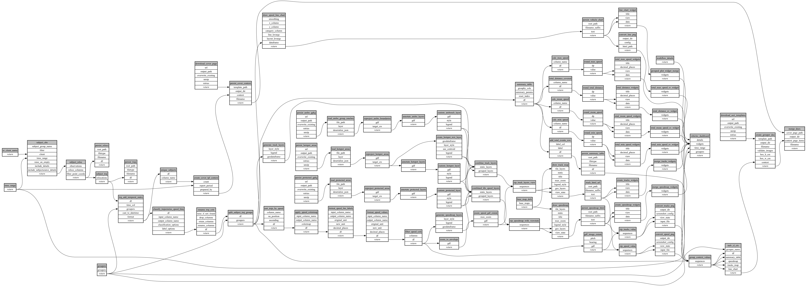

```
# AUTOGENERATED BY ECOSCOPE-WORKFLOWS; see fingerprint in README.md for details

```

```yaml
# fingerprint:
artifacts_sha256_basic: 66f413a261423c311f086c19804ba2c9ba201a7d3b7fa530767410ab78888c86
artifacts_sha256_strict: f91eb156185ebd667a320d81082830256436051cd64a6abca385a3421a893896
installed_requirements:
- channel: https://repo.prefix.dev/ecoscope-workflows/
  name: ecoscope-workflows-core
  version: {version: ==0.22.17}
- channel: https://repo.prefix.dev/ecoscope-workflows/
  name: ecoscope-workflows-ext-ecoscope
  version: {version: ==0.22.17}
- channel: https://repo.prefix.dev/ecoscope-workflows-custom/
  name: ecoscope-workflows-ext-custom
  version: {version: ==0.0.40}
- channel: https://repo.prefix.dev/ecoscope-workflows-custom/
  name: ecoscope-workflows-ext-ste
  version: {version: ==0.0.18}
- channel: https://repo.prefix.dev/ecoscope-workflows-custom/
  name: ecoscope-workflows-ext-mnc
  version: {version: ==0.0.7}
- channel: https://repo.prefix.dev/ecoscope-workflows-custom/
  name: ecoscope-workflows-ext-icf
  version: {version: ==0.0.0}
- channel: https://repo.prefix.dev/ecoscope-workflows-custom/
  name: ecoscope-workflows-ext-big-life
  version: {version: ==0.0.8}
- channel: https://repo.prefix.dev/ecoscope-workflows-custom/
  name: ecoscope-workflows-ext-lion-guardians
  version: {version: ==0.0.6}
params_sha256: 85262d2e1a1cce89d9c30e7dc7e159b709f92dccbdfe4b6e6ab2462dfb56e62c
spec_sha256: de25b6a3751fbeb55cd9864e72c2d7c3e0ffa28789f3862aeb59245e915c1656

```

# ecoscope-workflows-vehicles-report-workflow


